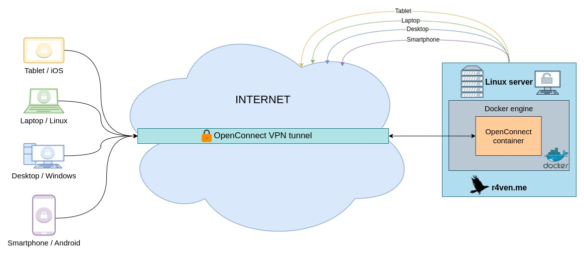

***This repo is a part of the complete instruction on [r4ven.me](https://r4ven.me/it-razdel/instrukcii/podnimaem-openconnect-ssl-vpn-server-ocserv-v-docker-dlya-vnutrennih-proektov/) for deploying an OpenConnect VPN server via docker and docker-compose. All source files of server and client available at a [src dir of this repo](https://github.com/r4ven-me/openconnect/tree/main/src).***



When using a domain to obtain SSL certificates, uncomment the certbot service and the depends_on parameter for the openconnect service, and specify your values instead of example in the docker-compose.yml file.

## Installation and configuration of the OpenConnect VPN server

1. Begin by creating a project directory
```bash
mkdir /opt/openconnect && cd /opt/openconnect
```

2. Copying the docker-compose.yml file
```bash
curl -O https://raw.githubusercontent.com/r4ven-me/openconnect/main/openconnect/docker-compose.yml
```

3. Launching the OpenConnect server
```bash
docker compose up -d && docker compose logs -f
```

4. Creating a user with the ID "exampleuser" and the name "Example User"
The .p12 certificate file will be created in ./data/secrets
```bash
docker exec -it openconnect ocuser exampleuser 'Example User'
docker exec -it openconnect ocuser -A steve 'Steve Jobs' - HarmonyOS/iOS
```

## Example of connecting the client using the openconnect utility
***You can also use my [bash script](https://github.com/r4ven-me/openconnect/blob/main/src/client/occlient.sh) for automatic connect to ocserv via openconnect client utiliy***

5. Without a domain
```bash
sudo openconnect -c /home/exampleuser/exampleuser.p12 12.345.67.89:43443 <<< $(echo "examplepassword"$'\n'yes$'\n')
```

6. With a domain
```bash
sudo openconnect -c /home/exampleuser/exampleuser.p12 example.com:43443 <<< $(echo "examplepassword"$'\n')
```